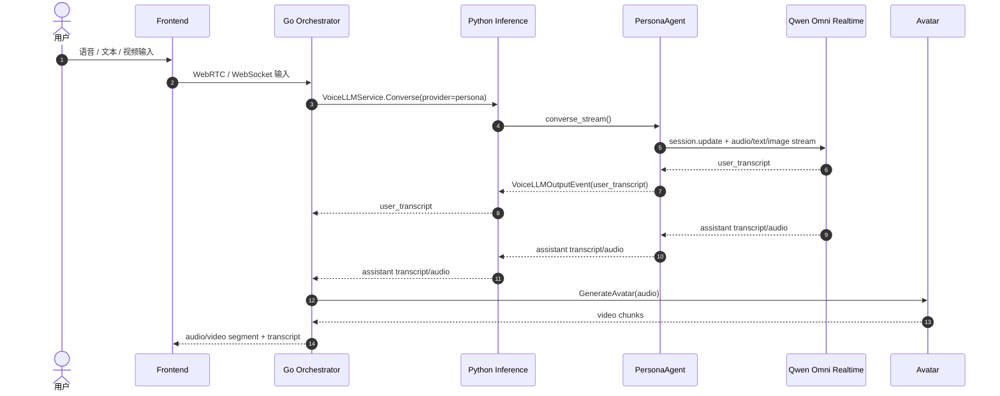
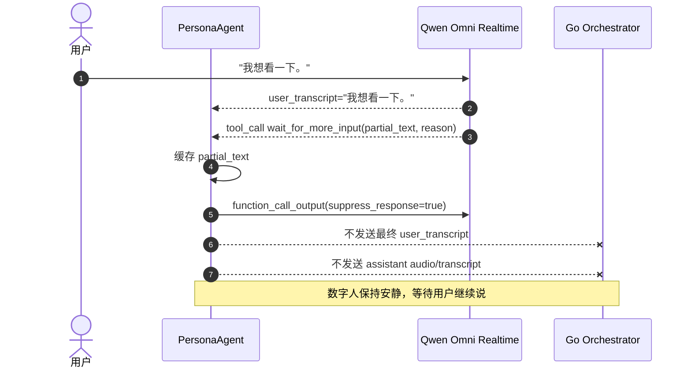
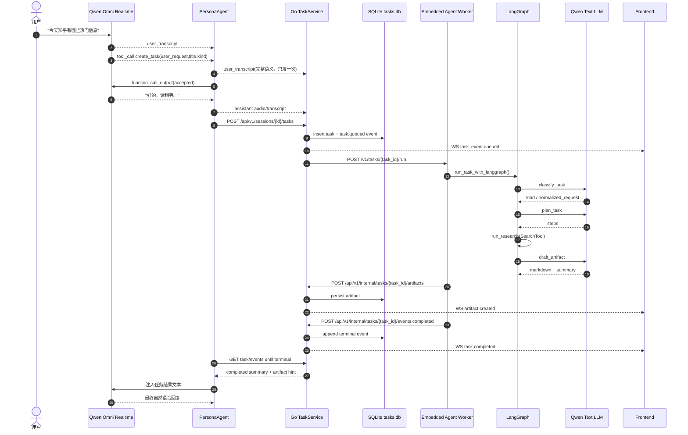
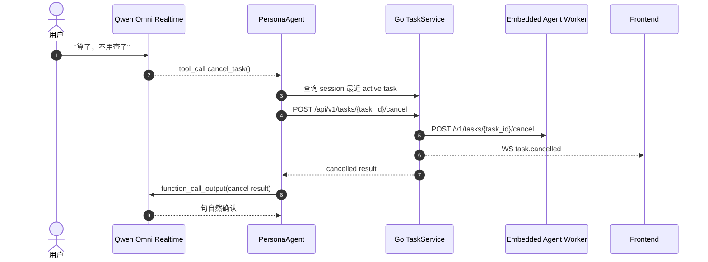

# PersonaAgent 与后台任务 MVP

文档语言：中文

## 基本信息

- 日期：`2026-05-11`
- 状态：`当前工作区已实现主链路`
- 主题：`Omni-only PersonaAgent + Go TaskService + LangGraph Agent Worker`

## 背景与问题

CyberVerse 是实时数字人对话系统。用户主要通过语音、视频和文本与数字人交互，普通聊天需要低延迟语音回复，搜索、调研、整理资料、生成报告这类请求则需要后台长任务。

旧的直接对话链路可以处理短回复，但不适合承载后台任务：

- 实时语音链路不能被长任务阻塞。
- Go Orchestrator 适合管理 session、WebSocket、Avatar 播放和任务状态，但不适合承载 Python LangGraph 生态。
- 任务进度、断线恢复、artifact 下载需要稳定的服务端状态。
- 只靠 Standard ASR final transcript 做任务判断会偏离 Omni-first 实时对话目标。

本次 MVP 采用 Omni-only 路径：PersonaAgent 作为 Python 侧的数字人编排层，包装真实 Qwen Omni Realtime 模型；Go 侧保留实时媒体管线和 TaskService；后台任务由 LangGraph Agent Worker 执行。

## 目标

- 用户通过 Omni 会话说出任务请求时，PersonaAgent 能通过 hidden tool 创建后台任务。
- 数字人先用一句自然语音确认，例如“好的，请稍等。”
- 任务在后台运行，进度通过 `task_event` 推送到前端。
- 任务完成后生成 markdown artifact，聊天侧展示可打开链接。
- 任务结果回灌给 PersonaAgent，再由 Omni 生成最终语音回复。
- LangGraph 后端使用真实文本 LLM，而不是本地模板或 mock 函数。
- 正常开发运行时不要求额外启动独立 `agent-worker` 进程。

## 非目标

- 本轮不扩展 Standard 模式的任务能力。
- 本轮不接入真实搜索供应商；默认搜索工具仍是 `NullSearchTool`。
- 本轮不重写 Go 实时音视频和 Avatar 播放管线。
- 本轮不解析用户可听见的 JSON；工具调用必须是模型 native structured tool call。

## 核心设计决策

### 1. PersonaAgent 不是模型，而是编排层

`PersonaAgentPlugin` 位于 `inference.persona` 配置域。它不是 `omni` 模型本身，而是包装真实 Omni provider 的编排层。

当前默认关系：

```yaml
inference:
  omni:
    default: "qwen_omni"
    qwen_omni:
      model: "qwen3.5-omni-flash-realtime"

  persona:
    persona:
      model_provider: "qwen_omni"
```

Go Orchestrator 对 Omni session 仍调用现有 `VoiceLLMService.Converse`，provider 为 `persona`。Python inference service 解析到 `persona.persona` 后，由 PersonaAgent 再调用真实 `omni.qwen_omni`。

### 2. 任务工具通过 Qwen native function calling

PersonaAgent 给 Qwen Realtime session 传入 hidden tools：

- `wait_for_more_input(partial_text, reason)`
- `create_task(user_request, title, kind="research")`
- `get_task_status()`
- `cancel_task()`

工具 schema 使用 Qwen 官方嵌套格式：

```json
{
  "type": "function",
  "function": {
    "name": "create_task",
    "description": "...",
    "parameters": {}
  }
}
```

工具激活时不发送 `tool_choice`，并关闭或忽略 `enable_search/search_options`，避免 Realtime 内置搜索和 hidden tool 路径混用。

### 3. create_task 采用“先确认，后异步启动任务”

任务类请求不把后台任务同步阻塞在工具调用里。

流程是：

1. Qwen Omni 触发 `create_task` tool call。
2. PersonaAgent 先回灌 accepted tool result。
3. Qwen Omni 生成一句语音确认。
4. 确认语音完成后，PersonaAgent 异步调用 Go TaskService 创建任务。
5. PersonaAgent 轮询任务终态，并把结果以文本注入同一个 Omni session。
6. Omni 基于任务结果生成最终语音回复。

这个设计保证数字人能快速回应用户，同时后台任务不会阻塞实时音视频链路。

### 4. Go TaskService 管状态，Python Agent Worker 干活

Go TaskService 是任务系统的状态中心：

- SQLite 持久化任务、事件和 artifact。
- 每个 task event 使用 task 内递增 `seq`，用于前端断线恢复。
- 广播 `task_event` 到对应 session。
- 对外提供 task API 和 artifact API。
- 对内接收 worker callback。

Python Agent Worker 是任务执行器：

- 运行 LangGraph research graph。
- 调用 SearchTool 和文本 LLM。
- 通过 callback 把进度、artifact 和终态写回 Go TaskService。

### 5. Agent Worker 默认内嵌在 inference 进程

之前需要单独启动 `rtk make agent-worker`。当前工作区改为 inference 进程内嵌启动 Agent Worker HTTP endpoint，默认：

```yaml
inference:
  agent_worker:
    enabled: true
    host: "127.0.0.1"
    port: 8090
```

Go TaskService 仍然通过 HTTP 调用 worker，这是因为 Go 进程不能直接 in-process 执行 Python LangGraph。但用户开发运行时不需要再额外起一个 worker 进程：

```bash
rtk make inference
rtk make server
rtk make frontend
```

`rtk make agent-worker` 保留为可选调试入口。

### 6. LangGraph 后端使用真实文本 LLM

`agent_runtime` 新增 OpenAI-compatible LLM 客户端。默认读取 `inference.llm.default`，当前配置为：

```yaml
inference:
  llm:
    default: "qwen"
    qwen:
      model: "qwen3.6-plus"
      extra_body:
        enable_thinking: false
```

LangGraph 节点中：

- `classify_task` 调 LLM 归一化任务。
- `plan_task` 调 LLM 生成计划。
- `draft_artifact` 调 LLM 生成 markdown artifact 和摘要。

这避免了把后台 agent 做成纯模板函数。

### 7. 语音未完成表达先通过 prompt 强化

当前 `wait_for_more_input` 仍依赖 Qwen Omni native tool selection。PersonaAgent system prompt 已强化：

- 未完成意图必须调用 `wait_for_more_input`。
- 不要追问、不要补全想象、不要输出语音回复。
- 判断未完成意图时看语义是否缺关键对象，而不是标点。
- few-shot 包含“我想看一下。”、“帮我查一下。”这类半句。

这是低复杂度方案。若真实模型仍不稳定，再评估更小侵入的结构化 turn gate。

## 用户可见行为

### 普通聊天

用户说完整闲聊或问答时，PersonaAgent 直接透传 Qwen Omni 的 `user_transcript`、assistant `transcript` 和 `audio`，Go Orchestrator 继续生成 Avatar 视频并播放。

### 未完成表达

用户只说半句时，预期 Qwen Omni 调用 `wait_for_more_input`。PersonaAgent 缓存 partial，不向 Go 发最终用户气泡，不触发数字人语音回复。

### 后台任务

用户说“今天知乎有哪些热门信息”这类请求时：

- 数字人先说一句确认。
- 聊天侧出现任务进度气泡。
- 任务完成后出现 artifact 链接。
- 数字人再用自然语音告知结果已整理。

### 断线恢复

前端重连后调用 task list 和 events API，按 `task_id/seq` 补齐断线期间的任务进度。

## 端到端时序图

### 1. Omni 普通聊天



### 2. 未完成表达等待更多输入



### 3. create_task 工具与后台任务



### 4. 取消任务



## 涉及模块

### Python inference / PersonaAgent

- `inference/plugins/voice_llm/persona_agent.py`
- `inference/plugins/voice_llm/qwen_omni_realtime.py`
- `inference/services/voice_llm_service.py`
- `inference/core/types.py`
- `inference/server.py`

### Python LangGraph Agent Worker

- `agent_runtime/server.py`
- `agent_runtime/graph.py`
- `agent_runtime/llm.py`
- `agent_runtime/callbacks.py`
- `agent_runtime/schemas.py`
- `agent_runtime/tools.py`
- `agent_runtime/i18n.py`

### Go TaskService / Orchestrator

- `server/internal/agenttask/service.go`
- `server/internal/agenttask/store.go`
- `server/internal/agenttask/types.go`
- `server/internal/api/tasks.go`
- `server/internal/api/router.go`
- `server/cmd/cyberverse-server/main.go`
- `server/internal/orchestrator/orchestrator.go`

### Frontend

- `frontend/src/composables/useChat.ts`
- `frontend/src/components/ChatPanel.vue`
- `frontend/src/services/api.ts`

### 配置与测试

- `cyberverse_config.yaml`
- `infra/cyberverse_config.example.yaml`
- `infra/.env.example`
- `pyproject.toml`
- `tests/unit/test_persona_agent_plugin.py`
- `tests/unit/test_qwen_omni_plugin.py`
- `tests/unit/test_agent_runtime_i18n.py`
- `tests/unit/test_agent_runtime_llm.py`
- `server/internal/agenttask/store_test.go`

## 实现细节

### 1. PersonaAgent

PersonaAgent 通过 `VoiceLLMPlugin` 接口兼容 Go 侧现有 `VoiceLLMService.Converse` 协议。它负责：

- 为真实 Omni provider 注入 PersonaAgent system prompt。
- 传入 hidden tool schema。
- 消费 native tool calls。
- 对 `wait_for_more_input` 做静默缓存。
- 对 `create_task` 做 accepted 工具结果和异步任务启动。
- 监听任务终态并把结果注入 Omni session。

工具 JSON 不会展示或朗读给用户。

### 2. Qwen Omni Realtime adapter

Qwen adapter 支持：

- 官方嵌套格式 tools schema。
- `conversation.item.create(function_call_output)` 回传工具结果。
- `response.create` 触发普通工具结果后的模型回复。
- `suppress_response=true` 时只发送 tool output，不触发回复。
- app-initiated text injection，用于任务完成后把结果注入同一 Omni session。
- INFO 日志只输出关键模型事件，流式 transcript/audio delta 降为 DEBUG。

### 3. Go TaskService

TaskService 提供：

- SQLite task store，默认路径为 `data/tasks/tasks.db`。
- WAL 模式。
- `tasks`、`task_events`、`artifacts`、`schema_migrations` 表。
- task 内递增 `seq`。
- 终态保护：`completed/failed/cancelled` 后拒绝迟到 running/completed/artifact。
- worker dispatch 前重新读取 task，已终态则跳过。

### 4. Agent Worker 与 LangGraph

Agent Worker 是 Python 执行入口，当前默认内嵌在 inference 进程，但仍暴露 HTTP endpoint 给 Go TaskService 调用。

LangGraph 节点：

```text
classify_task -> plan_task -> run_research -> draft_artifact -> finalize
```

其中 `classify_task`、`plan_task`、`draft_artifact` 使用 `agent_runtime.llm.OpenAICompatibleAgentLLM` 调真实文本 LLM。

`SearchTool` 当前仍是抽象：

- 默认：`NullSearchTool`
- 测试：`MockSearchTool`
- 真实 Tavily/Bing/Zhihu adapter 未接入

### 5. 前端任务展示

前端扩展了聊天状态：

- WS 处理 `task_event`
- WS 处理 `assistant_message`
- ChatPanel 展示任务进度气泡、完成状态、artifact 链接
- API client 增加 task list、events、artifact 相关方法
- 重连后用 task list + events API 补齐断线进度

## 协议 / 数据结构 / 配置变更

### Task API

- `POST /api/v1/sessions/{id}/tasks`
- `GET /api/v1/sessions/{id}/tasks`
- `GET /api/v1/tasks/{task_id}`
- `GET /api/v1/tasks/{task_id}/events?after_seq=N`
- `POST /api/v1/tasks/{task_id}/cancel`
- `GET /api/v1/tasks/{task_id}/artifacts/{artifact_id}`
- `POST /api/v1/internal/tasks/{task_id}/events`
- `POST /api/v1/internal/tasks/{task_id}/artifacts`

### WebSocket 消息

`task_event` 包含：

```json
{
  "type": "task_event",
  "task_id": "...",
  "session_id": "...",
  "seq": 1,
  "event_type": "task.started",
  "status": "running",
  "message": "后台任务已启动。",
  "progress": 5
}
```

`assistant_message` 用于数字人系统短回复降级展示。

### 关键配置

```yaml
inference:
  omni:
    default: "qwen_omni"
    qwen_omni:
      plugin_class: "inference.plugins.voice_llm.qwen_omni_realtime.QwenOmniRealtimePlugin"
      model: "qwen3.5-omni-flash-realtime"

  persona:
    persona:
      plugin_class: "inference.plugins.voice_llm.persona_agent.PersonaAgentPlugin"
      model_provider: "qwen_omni"

  agent_worker:
    enabled: true
    host: "127.0.0.1"
    port: 8090
    llm:
      provider: "qwen"

  llm:
    default: "qwen"
    qwen:
      plugin_class: "inference.plugins.llm.qwen_plugin.QwenLLMPlugin"
      model: "qwen3.6-plus"
```

环境变量：

- `DASHSCOPE_API_KEY`：Qwen Omni 和 Qwen text LLM 使用。
- `AGENT_WORKER_URL`：Go TaskService 调用 worker 的地址，默认 `http://localhost:8090`。
- `AGENT_INTERNAL_TOKEN`：Go TaskService 与 worker callback 的内部鉴权 token，可为空。
- `CYBERVERSE_SERVER_URL`：Python worker callback 到 Go API 的地址，默认 `http://localhost:8080/api/v1`。

## 风险与限制

- `wait_for_more_input` 仍依赖 Qwen Omni 遵守 prompt 和 native tool selection；当前未加额外 turn gate。
- 默认搜索工具是 `NullSearchTool`，真实外部热点、天气、网页搜索还不能返回真实数据。
- Agent Worker 虽然内嵌在 inference 进程，但 Go 到 Python 仍通过 HTTP 边界通信。
- 任务执行和 PersonaAgent 轮询终态目前是 MVP 方案，后续可改为事件驱动。
- LangGraph 使用 OpenAI-compatible API，运行时需要对应 API key 和网络可用。

## 验证方式

当前工作区已执行：

```bash
rtk proxy python -m pytest tests/unit -q
rtk go test ./...
rtk npm run build
```

结果：

- Python unit：`143 passed, 4 skipped`
- Go test：`93 passed`
- Frontend build：通过

## 回滚思路

最小回滚面：

1. Go 侧保留 TaskService API 但不把 Omni provider 指向 `persona`。
2. inference 配置把 Omni provider 回退到真实模型 provider，例如 `qwen_omni`。
3. 前端任务气泡和 task API client 可以保留，不影响普通聊天。
4. 如需完全回滚任务系统，移除 `agenttask` service 初始化和 task routes。

## 后续待办

- 接入真实 SearchTool adapter，例如 Tavily、Bing、知乎热点或天气服务。
- 观察 Qwen Omni 对 `wait_for_more_input` 的遵守情况，必要时再设计更小侵入的结构化 turn gate。
- 把 PersonaAgent 任务完成通知从轮询改为事件驱动。
- 增加端到端集成测试：语音任务创建、任务完成回灌、取消后无迟到事件、断线重连补事件。
